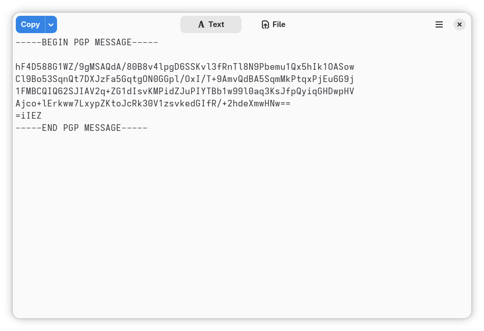
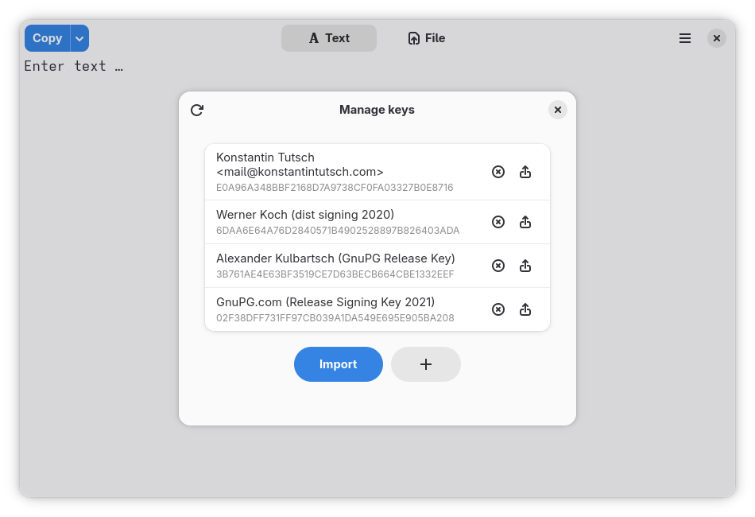

# Lock   

---

Lock now has all the features I had planned for it. This project is therefore complete for me, and I will no longer be maintaining it.

You are welcome to fork this repository and continue working on Lock if you wish. That's why Lock is open-source software! 🤝

---

Process data with GnuPG

_Lock_ is a graphical front-end for GnuPG (GPG) making use of a beautiful LibAdwaita GUI.

Process text and files:

- Encryption
- Decryption
- Signing
- Verification

Manage your GnuPG keyring:

- Generate new key pairs
- Import keys
- Export public keys
- View expire dates
- Update expire dates of expired keys
- Remove keys

## Showcase

